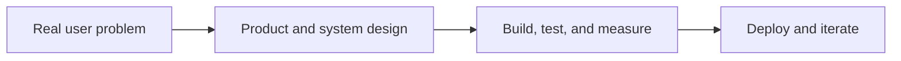

---

## 👋 About me

CSE undergraduate at SRM IST | CGPA: 9.34 / 10 | Graduating: 2027

I build full-stack and AI-powered products with a focus on:
→ clean architecture
→ data reliability
→ explainable decisions
→ real-world usability

- 🧠 Interested in Software Engineering, AI/ML, Data Science, and Analytics
- 🔬 Research presenter: CNN-LSTM Image Captioning at ICSTAICE 2026
- 🏆 4th place at HackVega 2.0 among 47,700+ registrations
- 🚀 Building systems with ML, APIs, databases, testing, and deployment

<b>What I care about</b>

 

- Full-stack engineering: React interfaces, Flask/FastAPI services, databases, and APIs.
- Applied AI/ML: computer vision, NLP, fraud detection, explainability, and analytics.
- Systems thinking: retries, queues, validation, observability, audit trails, and role-based workflows.
- Open to software engineering, AI/ML, data science, and analytics opportunities.

---

## Engineering toolkit

### Languages

### AI, Machine Learning & Data

### Backend, APIs & Testing

### Frontend & Dashboards

### Databases, Cloud & Developer Tools

---

## Selected projects

| Project | What it demonstrates | Tech |
| --- | --- | --- |
| **[VisionSpeaks](https://github.com/Neha-0019/VisionSpeaks)** | AI image-caption generator using a ResNet-50 encoder and LSTM decoder to turn visual inputs into natural-language descriptions. | Python · PyTorch · ResNet-50 · LSTM |
| **[PhishNet](https://github.com/Neha-0019/PhishNet)** | Explainable phishing-detection platform using Random Forest, XGBoost, and SVM, with a Flask API, React dashboard, SHAP, bulk URL scanning, and Chrome extension. | Python · JavaScript · Flask · React · SHAP |
| **[Jobsphere Distributed Job Scheduler](https://github.com/Neha-0019/Jobsphere-Distributed-Job-Scheduler)** | Production-inspired job scheduler with user management, worker orchestration, retries, dead-letter queues, and workflow dependencies. | React · Flask · SQLAlchemy · PostgreSQL |
| **[LeaveTrack](https://github.com/Neha-0019/LeaveTrack)** | Enterprise leave-management system with auditable policy rules, role-based workflows, KPI reporting, and automated testing. | Python · Flask · SQLite · Pytest |
| **[WasteVision-AI](https://github.com/Neha-0019/WasteVision-AI)** | Computer-vision system for automated waste classification and smart sorting with real-time analytics. | Python · EfficientNetV2 · Flask · ML |
| **[Reconcio](https://github.com/Neha-0019/Reconcio)** | Explainable AI finance controller for gateway, bank, and ledger reconciliation with audit evidence and honest exceptions. | FastAPI · Streamlit · SQLite |

---

## 📈 GitHub activity

  

---

### Let’s build something useful.

Open to internships, collaborations, and opportunities in  
**Software Engineering · AI/ML · Data Science · Analytics**

---

## How I build

I am especially interested in software that combines strong engineering with useful intelligence: systems that are dependable for users and explainable to reviewers.

**Open to internships, collaborations, and full-time opportunities in software engineering, AI/ML, data science, and analytics.**

