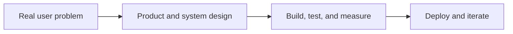

```md
<div align="center">

# Neha Panbude

### Software Engineering · AI/ML · Data Systems

`CSE @ SRM IST` · `Full-stack systems` · `Applied AI/ML` · `Class of 2027`

[](YOUR_LINKEDIN_URL)
[](#selected-projects)
[](mailto:YOUR_PUBLIC_EMAIL)

</div>

---

## Building practical systems, end to end

I am a Computer Science undergraduate at SRM Institute of Science and Technology with a **9.34/10 CGPA**. My work spans full-stack applications, distributed systems, applied machine learning, and data products - from problem definition and model design to APIs, testing, and deployment.

```text
UNDERSTAND  →  identify the operational problem
ENGINEER    →  build reliable systems and APIs
VALIDATE    →  test behaviour and make results explainable
DELIVER     →  deploy useful products with measurable impact
```

<details open>
<summary><b>What I care about</b></summary>
<br>

- Full-stack engineering: React interfaces, Flask/FastAPI services, databases, and APIs.
- Applied AI/ML: computer vision, NLP, fraud detection, explainability, and analytics.
- Systems thinking: retries, queues, validation, observability, audit trails, and role-based workflows.
- Open to software engineering, AI/ML, data science, and analytics opportunities.

</details>

---

## Engineering toolkit

<div align="center">

**Languages**<br>


**Data & AI**<br>


**Product & platform**<br>


</div>

---

## Selected projects

| Project | What it demonstrates | Tech |
| --- | --- | --- |
| **[VisionSpeaks](https://github.com/Neha-0019/VisionSpeaks)** | AI image-caption generator using a ResNet-50 encoder and LSTM decoder to turn visual inputs into natural-language descriptions. | Python · PyTorch · ResNet-50 · LSTM |
| **[PhishNet](https://github.com/Neha-0019/PhishNet)** | Explainable phishing-detection platform using Random Forest, XGBoost, and SVM, with a Flask API, React dashboard, SHAP, bulk URL scanning, and Chrome extension. | Python · JavaScript · Flask · React · SHAP |
| **[Jobsphere Distributed Job Scheduler](https://github.com/Neha-0019/Jobsphere-Distributed-Job-Scheduler)** | Production-inspired job scheduler with user management, worker orchestration, retries, dead-letter queues, and workflow dependencies. | React · Flask · SQLAlchemy · PostgreSQL |
| **[LeaveTrack](https://github.com/Neha-0019/LeaveTrack)** | Enterprise leave-management system with auditable policy rules, role-based workflows, KPI reporting, and automated testing. | Python · Flask · SQLite · Pytest |
| **[WasteVision-AI](https://github.com/Neha-0019/WasteVision-AI)** | Computer-vision system for automated waste classification and smart sorting with real-time analytics. | Python · EfficientNetV2 · Flask · ML |
| **[Reconcio](https://github.com/Neha-0019/Reconcio)** | Explainable AI finance controller for gateway, bank, and ledger reconciliation with audit evidence and honest exceptions. | [Live App](https://reconcio-finance-controller.streamlit.app/) · FastAPI · Streamlit · SQLite |

---

## A few signals of momentum

- **Research:** Authored and presented a CNN-LSTM image-captioning paper at ICSTAICE 2026.
- **Competitive building:** Placed **4th at HackVega 2.0** from 47,700+ registrations.
- **Leadership:** Led content and communication for a 60+ member technical club.
- **Industry experience:** Data Science Intern at InternzLearn and Web Developer Intern at VaultofCodes.

---

## How I build



I am especially interested in software that combines strong engineering with useful intelligence: systems that are dependable for users and explainable to reviewers.

<div align="center">

**Open to internships, collaborations, and full-time opportunities in software engineering, AI/ML, data science, and analytics.**

</div>
```

Replace these before saving:

```text
YOUR_LINKEDIN_URL
YOUR_PUBLIC_EMAIL
```
